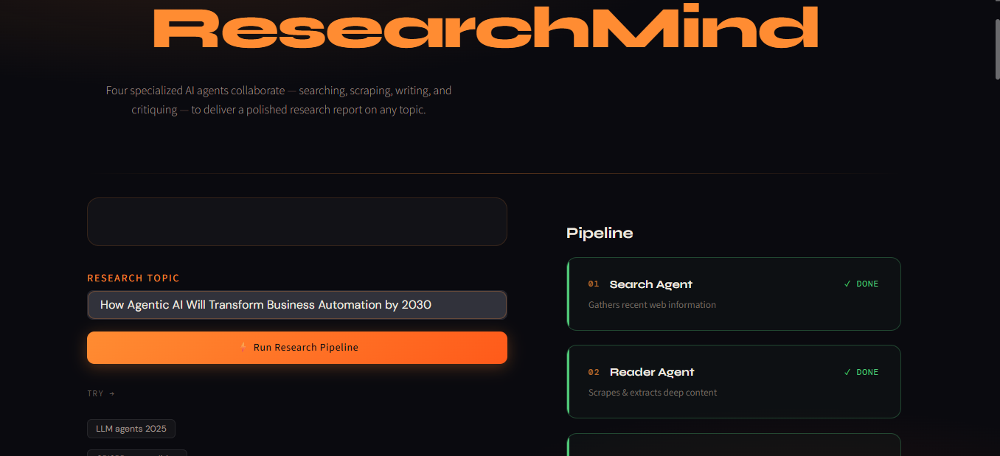
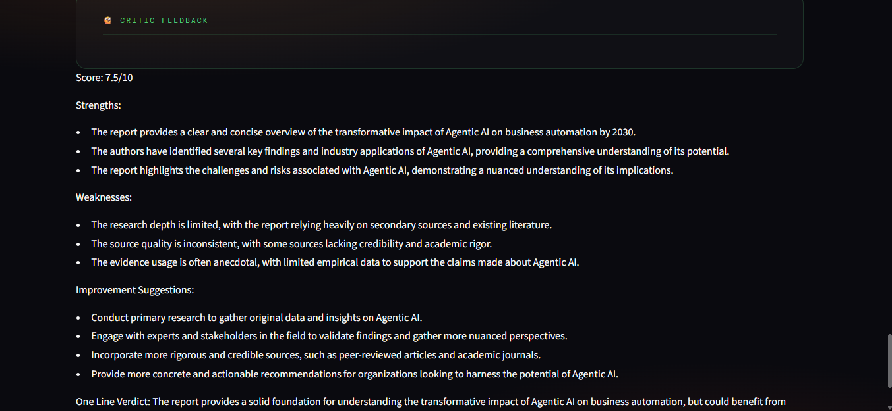

# 🔬 ResearchMind – Multi-Agent AI Research Assistant

ResearchMind is a Multi-Agent AI Research System that autonomously searches the web, extracts relevant information, generates detailed research reports, and evaluates report quality using a critic agent.

Built using LangChain, Groq LLMs, Tavily Search, and Streamlit.

------


## 🚀 Live Demo

**Live Application:** https://researchmind-ai-agent-4fvk.onrender.com

------

## 📸 Screenshots

### Home Page



### Research Report Generation


### Critic Feedback



-------

## ✨ Features

* 🔍 Search Agent – Finds recent and relevant information from the web
* 📄 Reader Agent – Scrapes and extracts useful content from websites
* ✍️ Writer Agent – Generates structured research reports
* 🧐 Critic Agent – Reviews reports and provides quality feedback
* 📥 Downloadable Reports
* 🎨 Modern Streamlit UI
* ☁️ Render Deployment

---

## 🏗️ System Architecture

```text
User Query
     │
     ▼
Search Agent
(Tavily Search)
     │
     ▼
Reader Agent
(Web Scraping)
     │
     ▼
Writer Agent
(Research Report Generation)
     │
     ▼
Critic Agent
(Quality Evaluation)
     │
     ▼
Final Research Report
```

---

## 🛠️ Tech Stack

### AI & LLM

* LangChain
* Groq API
* Llama Models

### Search & Retrieval

* Tavily Search API
* Web Scraping
* BeautifulSoup

### Frontend

* Streamlit

### Deployment

* Render

---

## 📂 Project Structure

```text
ResearchMind-AI-Agent/
│
├── app.py
├── agents.py
├── pipeline.py
├── tools.py
├── requirements.txt
├── README.md
└── .gitignore
```

---

## ⚙️ Installation

### Clone Repository

```bash
git clone https://github.com/yogeshgupta89577-max/ResearchMind-AI-Agent.git
cd ResearchMind-AI-Agent
```

### Create Virtual Environment

```bash
python -m venv venv
```

### Activate Environment

Windows:

```bash
venv\Scripts\activate
```

Linux/Mac:

```bash
source venv/bin/activate
```

### Install Dependencies

```bash
pip install -r requirements.txt
```

---

## 🔑 Environment Variables

Create a `.env` file:

```env
GROQ_API_KEY=your_groq_api_key
TAVILY_API_KEY=your_tavily_api_key
```

---

## ▶️ Run Locally

```bash
streamlit run app.py
```

---

## 📊 Example Research Topics

* How Agentic AI Will Transform Business Automation by 2030
* Future of Autonomous AI Agents
* Impact of Generative AI on Global Businesses
* Quantum Computing Breakthroughs
* Future of Human-AI Collaboration

---

## 🎯 Learning Outcomes

This project demonstrates:

* Multi-Agent AI Systems
* Tool Calling with LLMs
* Web Search Integration
* Web Scraping Pipelines
* Autonomous Research Workflows
* LangChain Agent Architecture
* AI Report Generation
* Prompt Engineering
* Deployment of AI Applications

---

## 👨‍💻 Author

**Yogesh Gupta**

* B.Tech (Electronics Engineering)
* KNIT Sultanpur

GitHub:
https://github.com/yogeshgupta89577-max

---

## ⭐ Future Enhancements

* Multi-source document synthesis
* PDF report generation
* Citation-aware research reports
* Research history tracking
* RAG-based knowledge storage
* Multi-format export support
